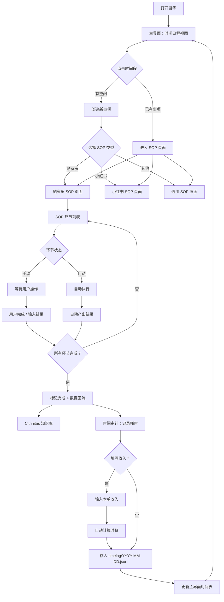

# Rubedo · 凝华 — 流程图

> 纯逻辑流程，展示数据如何在凝华中流动。每个节点标注输入/输出/逻辑。

---

## 主干流程

---

## 节点定义

| 节点ID | 名称 | 输入 | 输出 | 逻辑 |
|--------|------|------|------|------|
| A | 启动 | 用户打开程序 | 进入主界面 | 初始化数据，加载今日日程 |
| B | 主界面 | 今日日程列表 | 时间日程视图 | 按时间排列待处理事项，显示状态（待做/进行中/已完成） |
| C | 时间段交互 | 用户点击 | 分流：已有事项→E，空闲→D | 判断该时间段是否已有分配的事项 |
| D | 新建事项 | 用户输入（事项名+SOP类型） | 新事项加入日程 | 弹窗让用户选 SOP 类型和描述 |
| E | 进入 SOP 页 | 事项信息（类型+描述） | 对应 SOP 页面 | 根据事项的 SOP 类型路由到对应页面 |
| F | SOP 类型选择 | 用户选择 | G1/G2/G3 | 目前支持酷家乐+小红书+通用 |
| G1/G2/G3 | SOP 页面 | SOP 环节定义 | H | 加载该 SOP 的环节列表和每个环节的自动/手动状态 |
| H | 环节列表 | 当前 SOP 的所有环节 | I | 按顺序展示，标注状态（待执行/执行中/已完成） |
| I | 环节状态判断 | 当前环节的配置 | J 或 K | 读取该环节的"手动/自动"开关 |
| J | 手动执行 | 用户操作 | L | 等待用户完成操作或输入结果 |
| K | 自动执行 | 外部数据/API/规则 | M | 调用对应工具自动产出 |
| L | 手动结果 | 用户输入 | N | 记录结果，标记环节完成 |
| M | 自动结果 | 工具产出 | N | 记录结果，标记环节完成 |
| N | 完成判断 | 所有环节状态 | H 或 O | 还有未完成环节→回到H；全部完成→O |
| O | SOP 完成 | 整单执行数据 | P + TA | 打包执行记录，写入 Citrinitas，触发时间审计 |
| P | Citrinitas | 执行记录 JSON | 存入知识库 | 通过项目间通信接口写入（v1.3.0 规划中） |
| TA | 时间审计 | 整单执行数据（开始/结束时间） | TB | 自动记录 SOP 执行耗时 |
| TB | 收入确认 | 耗时 + SOP 类型 | TC 或 TE | 询问用户是否填写收入 |
| TC | 收入输入 | 用户输入收入金额 | TD | 弹窗输入本单收入 |
| TD | 时薪计算 | 耗时 + 收入 | TE | 时薪 = 收入 / 耗时（小时） |
| TE | 时薪存储 | 时薪 + 完整执行记录 | Q | 写入 data/timelog/YYYY-MM-DD.json |
| Q | 日程更新 | 完成状态 | B | 主界面刷新，已完成事项打勾或移除 |

---

## 节点间连接

| 起→止 | 传递内容 | 触发条件 |
|-------|---------|---------|
| A→B | 今日日程数据 | 程序启动完成 |
| B→C | 用户点击坐标/时间段ID | 用户点击时间格子 |
| C→D | 空时间段 | 该时间段无事项 |
| C→E | 事项ID+SOP类型 | 该时间段已有事项 |
| D→F | — | 用户确认创建 |
| E→G1/G2/G3 | 事项数据 | 按 SOP 类型路由 |
| F→G1/G2/G3 | 事项数据 | 按用户选择的 SOP 类型路由 |
| G*→H | SOP 环节定义+状态 | 页面加载 |
| H→I | 当前环节 | 用户/系统触发"下一步" |
| I→J | 环节定义 | 环节状态=手动 |
| I→K | 环节定义+输入数据 | 环节状态=自动 |
| J→L | 用户输入/确认 | 用户完成操作 |
| K→M | 工具产出 | 自动执行完成 |
| L→N | 环节结果 | 结果记录完成 |
| M→N | 环节结果 | 结果记录完成 |
| N→H | 下一环节ID | 还有环节未完成 |
| N→O | 全部环节结果 | 所有环节完成 |
| O→P | 执行记录 | 数据回流 |
| O→TA | 执行记录（含开始/结束时间） | SOP 完成 |
| TA→TB | 耗时数据 | 计时结束 |
| TB→TC | — | 用户选择填写收入 |
| TB→TE | — | 用户跳过收入填写 |
| TC→TD | 收入金额 | 用户确认 |
| TD→TE | 时薪计算结果 | 计算完成 |
| TE→Q | 更新后的日程状态 | 存储完成 |
| Q→B | 更新后的日程 | 主界面刷新 |

---

> 版本：v1.1 | 更新于：2026-06-25 | 新增时间审计分支(TA~TE) + 16→23 节点
